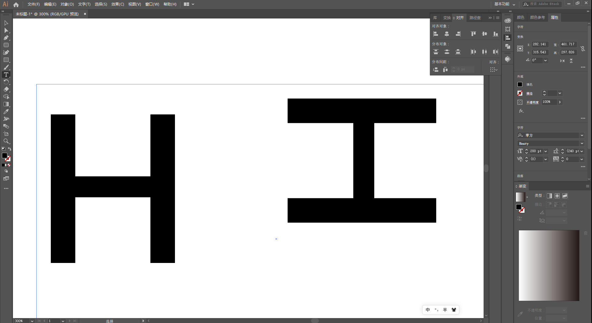
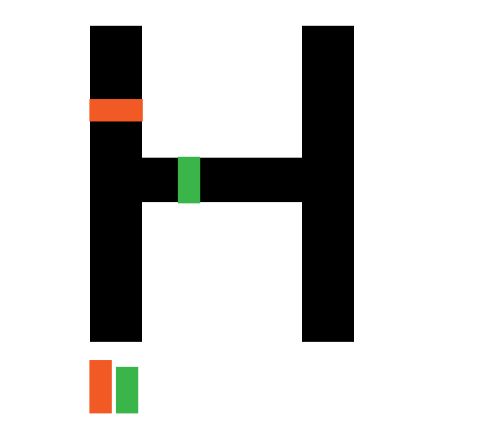

# 引言

## 什么是排版？

宏观：将所需的文字、图片和所有内容按照某种规律排列在有限的画布上；

狭义：一切以引导观众视线为目的的技巧；

>   设计师就如同一位心理医生层层剥离病患的内心，分析用户需求，寻找合理方法，慢慢引导他的思想到正确的地方；
>
>   排版是传达信息的一种手段；

**它包括什么？**

-   平面设计的一切内容；
-   网页？就是那些UI哒！
-   论文，文章等这类最基础的阅读书；
-   杂志，包含一定专业信息的书籍；
    -   时尚杂志，每一个模块都要能让读者感受出作者的思想；
    -   技术杂志，需要排版来调整文章的节奏，让读者能更好抓住重点，同时让他能跟持久舒适的阅读；
    -   等等。。。

## 什么是美学？

美学，哲学属下的二级学科，它是一种研究人的审美的学问。它既是一门思辨的学科，又是一门感性的学科。美学与心理学、语言学、人类学、神话学等有着紧密联系。

由它延伸出的学科很多，例如：

-   平面设计；
-   UI设计；
-   色彩理论；
-   书籍印刷；
-   建筑；
-   等等。。。

绝大多数的存在都不易被人们察觉，但它们渗透在生活的每一个角落；

它们大多以如何让看到他们的人感到舒服为首要目的，而不是为了惊艳他们；

其中，这种让人感到舒适的手段就是当前的设计风向（例如今年来的简约，ins风等）

设计的风格给人带来的舒适度总体来说是不断上升的，这是优胜劣汰的必然结果。

上述中，我们提到了“大多设计的存在不是为了惊艳别人”，但惊艳是什么呢？

**什么是惊艳？**

惊艳本身就是人们在感受过众多同类物品后对新发现的内容的好奇，而这种好奇往往是短暂的，因此大多设计师都不会选择设计一个惊艳的东西，因为难度巨大，所以他们往往会选择当前的时尚潮流作为设计出发点。但凡事都有例外，只要你足够强大，你设计出的惊艳事物带给观众的舒适度远远超于其他同类旧事物时，那这个惊艳的设计就是一门全新的艺术。例如拟物风、简约风到现在新兴的新拟态的变化，简约的设计在00年时代就已存在，甚至其起源远早于当时盛行的拟物风，但它的崛起是在10年那次微软的UI创新，它的成功让简约风风靡全球。

分析：

拟物一定程度上说 是将一个三维物体通过二维物体的方式展示在二维平面上，而人要从二维平面上读出一个二维物体所代表的三维信息是有一定计算量的，因此拟物设计出来的UI往往有较深的视觉深度，虽然能让人一目了然，但是人们在使用过程中，需要不断在不同深度间切换，长期使用会感到十分疲劳，无论是审美还是脑力。这个疲劳的原因和3D眩晕有点类似，都可归结于人对于二维的三维信息的处理不适性，有过3D眩晕体验的同学应该会更好地理解这种疲劳感是多么得难受。

简约就完全抛弃了深度信息，它的依据就是平面设计基本定理中的完整律，人们看到一个残缺的物品会本能脑补出这个物体的所有可能缺少信息，因此简约设计出的产品往往具有很少的深度（甚至于没有）。但，人是有极限的，越是脑补就会发现自身脑补能力的不足，因此需要一定的抽象想象才能脑补出该事物原代表的信息，长期使用会产生严重的审美疲劳。而且简约UI失去了深度信息，因此观众用于辨别UI类型的依据就仅剩对比度，因此设计不同的对比是简约设计的核心，当然，设计得不好也是一种灾难。

这时候，一个名为新拟态的设计风格出现了，它巧妙增加了一点点深度信息，让一个平面简约物体可以蕴含更多的信息，就如2.5D设计一样，提供了一种伪立体感的对比度，让设计师可以用有限的颜色做出更多的内容。

提供深度信息有利于用户分辨信息，就如Mac的抽屉图标（举个Mac抽屉例子），左边的是没有深度信息的图标，而右边是现在Big Sur的图标。用户在第一次观察图标时，但看左边可以理解出非常多的内容，但若加点深度，用户在分辨时会很自然地剔除所有不含深度的内容，让用户面临的选择项大大减少。

**总结：**

设计风格的发展正如马克思所说：一切事物都遵循着否定之否定规律，事物自身的发展又是波浪式螺旋上升的。

>   新拟态：
>
>   介绍：[新拟态——国外设计师分析的全新UI趋势 | 人人都是产品经理 (woshipm.com)](http://www.woshipm.com/pd/3386232.html)
>
>   落实：[为什么2020年初爆火的新拟物化设计，完全无法落地使用？ - 优设网 - UISDC](https://www.uisdc.com/neumorphism-ui)

## 为什么要了解基本定理？

平面设计的基本定理，同样也是美学的基本定理，是前人对美学研究的研究成果，是人类智慧的结晶！

一切被大众广为接受的设计风格都能看到这些基本定理的身影！

基本定理即是这些风格的抽象产物，也是辅助设计师设计的重要工具。

掌握这些定律可以让你很快地排版出一个让人舒服的画面，无论是什么都可以，就如论文、书籍、PPT乃至平面设计。

美学法则有很多，就如颜色和图形，一旦你知道了一条线能产生怎样的张力或颜色是多么什么神秘和有怎样的表现力时，你就会以另一个视角看待这些设计，乃至这个世界。你可以很轻易地分析出它内在的美学逻辑，然后模块化变成你自己的，甚至继承它创造出一个更好的设计。当然，前提是你真的掌握了这些美学法则。

就我个人来说，其实也就学会了一些皮毛，但这些皮毛已经让我受益匪浅。

这次课就来介绍一下平面设计的这几个基本定理，希望大家日后可以有意识地把它们加入到自己的设计、文字乃至PPT中，给观众一份优质的阅读体验！

# 平面设计基本定律（格式塔视知觉原理）

-   <格式塔心理学>（gestalt psychology），又叫完形心理学，是西方现代心理学的主要学派之一。上个世纪初，奥地利及德国的心理学家创立了格式塔理论（Gestalt），它强调经验和行为的整体性，反对当时流行的构造主义元素学说和行为主义“刺激－反应”公式，认为整体不等于部分之和，意识不等于感觉元素的集合，行为不等于反射弧的循环。
    -   有趣的例子：尼尔：格式塔中将人分为了肉体和灵魂，但这却又是现实中被格式塔理论反对的。这些矛盾构成了尼尔的哲学体系故事背景，就如那些以哲学家名字命名的BOSS一样，尼尔一二全篇围绕着肉体和灵魂间的关系展开。
-   格式塔视知觉理论中很多心理学依据来自于格式塔心理学，有兴趣可以了解一下。

## 接近律

**定义：** 距离相近的物体易被是做一个整体。

其中距离这个词是个抽象概念，它不止空间位置，同样也可以作为颜色的对比度，等等。

下面来从个例子中感受一下！

【讲稿略】

## 连续律

**定义：** 沿着某一平直或曲折的线排列的元素比那些不在同一线上的元素看起来更具有整体性。

而这一切的前提是这些被排列起来的元素满足接近律，因为接近才会被看做一个整体。

下面来从几个例子中感受一下！

【讲稿略】

## 完整律

人们在观察事物的时候总是希望发现一些规律，这是有一定心理学依据的。在这种心理的强烈作用下，我们甚至能发现原本不存在的相互关联的图形，因此有了完整律的定义。

**定义：** 人们会自行脑补出原本图形中不存在的相互关联的图形。

当然，完整律的前提也是接近律。

下面来从几个例子中感受一下！

【讲稿略】

接近律的使用会影响完整律，影响到人们脑补出的结果。

就如同这两个图形，它们形状相同，不同的在于它们在画面中的位置，相对于第二张来说观众更容易将第一张内的图形脑补为一个圆。大家可以感受一下。但如果我再为它创造一个接近律，例如在它下面添加一个词，并修改下颜色。就像【图例】所示，观众在观察它时，相比之前第二张更容易将它当成一个圆。

由于人对于文字的解读速度是远弱于图形的，因此观众并不会第一时间将下面的文字和图形联想起来，只有颜色和图形才能作为第一标签被观众用于标识物体，因此延伸出了LOGO设计这一概念，目的就是设计出一个标志，让用户第一眼就能分辨出这个物体或公司是什么。

完整律对于设计师来说意义重大，因为设计师可以通过观察把彼此关联的元素组合起来，使得它变成一个与原图形不同的完整的图形，又能让观众从中获取到原图形的所有完整的信息，使一个图形可以包含远超于一个图形所具有的内容。完整律也是简约设计的一种思想核心，而这个思想核心同样Logo设计中最重要的一个部分！

而在LOGO设计中，不仅仅有图形设计，还有很多如【图例】所示的这些曲线的动态设计原理，它们的作用是让自身从众多类似形状中的LOGO中独立出来，因为人们除了能脑补静态的图形，还能从静态的曲线中脑补出动态的运动，这些细节是图形在另一个维度上的标志，就如同立定跳远和三级蛙跳一样，有着相似的行为，但细节将这两种行为行为区分了开来。

## 相似律

**定义：** 形状相同的物体和大小相同的物体易被当做整体来看待。

本质上是接近律的另一种说法，其中的“距离”为形状和图形大小这两个抽象元素，但之所以单独作为一个定理，因为它和接近律中的效果相差甚远，即相似律的优先级相对较低，是完整律和接近律相互作用后诞生的效果。

>   以上四个就是格式塔理论中最重要的四个法则，后面的三个是由它们延伸出的设计法则。

## 干扰效应

**定义：** 在同一个图像中出现两种相互对立的表达。

这样会很好的刺激观赏者。（例子）

【讲稿略】

广告设计可以有意识地制造这种刺激以吸引观赏者的注意，但传递信息的交流性设计则要避免这种效应。

两个或更多的感知或认知过程干扰效应就产生了。人类的感知包括许多不同的心智系统，它们独立地剖析和加工各个信息。这些系统的输出被传送到工作记忆区，从而被解读。如果输出合适，解读过程迅速，结果最佳。反之，如果输出不合适，就会有干扰产生，需要额外的处理来解决冲突。解决些冲突所需的额外时间对结果产生负面影响。

但有趣的是，这些冲突导致的负面影响会刺激观众的思考，当观众思考了，那么他就会注意到你的广告，只要其他设计得当，他就会选择继续阅读你的广告，最终让你的广告成功被安利给了这位观众。

同样，冲突的表达不只是上面那个案例中的颜色，还有行为、常识等。就如第一幅海报，地铁上居然有人会站在位子上？再一看，哦，the shining。第二副海报，三次元里有粉色头发？再一看，哦，迷失东京。

>   更详细更学术的见下面百科，感兴趣的可以看看。
>
>   more：https://wiki.mbalib.com/wiki/Stroop%E6%95%88%E5%BA%94

## 希克斯定律

**定义：** 一个人面临的选择越多，他做出某一决定所需的时间就越长。

换句话说就是选择困难症是普遍存在的。

在大多数人在广告信息上只会花很少时间而且几乎不会深入研究的前提下，这一定律对于广告设计师就有着重要意义。同样，对于做比赛答辩或PPT汇报时，评委之后花很少时间而且就不会深入研究，如何排版自己的PPT和文章就是一门学问，希克斯定律也就有非常重要的意义。

在上述这些比赛、广告什么的的情况下，设计师要尽可能减少提供给观赏者的选择，或者是是信息，也就是说你要传达的图像及内容信息要集中在一点上。这样观赏者自己就能很快地加工和整理这些信息。

这就是设计师常挂在口中的“越少即越多”！

## KISS法则

**定义：** Keep It Simple and Stupid

优秀的设计应该始终保持简单明了，由希克斯定律很容易推导出这一法则，即KISS法则也包含了“越少即越多”的意思。

## 可靠性

美观的设计能获得人们的喜爱和信任，也因此有利于产品的销售。但这不代表要为每件产品都尽可能地做出一流的设计。

Apple & 椰汁牌

【讲稿略】

一流的设计，如华丽的包装，使产品显得奢华，而这对我们来说也往往意味着高价。

同理，我们部门设计的海报，例如是一个体育活动的海报，它设计一流，精美优雅简约大方，这无形中也会在海报和广大学生之间树立起一个隔阂，让他们敬而远之。若是一个学术竞赛的海报，它朴素得如椰汁牌一样，同学们同样也会敬而远之。所以，如何让我们的海报亲民但由舒适就是我们设计时要考虑的事。同样，凡事都有例外，规则就是用来打破的，若你的海报设计理念上不和海报的内容，但又吸引着学生的参与欲，那么这同样也是成功的。

## 设计师是个钟表匠

设计师常常要处理十分细微的细节，不做设计的人可能难以理解这种对细节的执着。

设计师就行一个钟表匠，把最细微的细节一个个进行调整，因为它们对于画面整体表现出来的效果来说是不可或缺的存在。

**部分的总和**： 如果不关注最细微的细节，设计时就不能做出美观的设计。

整体是各个部分的总和，但如果各个部分能够相互协调，那个表现出的整体就远远大于总和了！这点非常重要，随着大家排版的文章、制作的PPT乃至海报做多了后，你们也可能会对这些细节变得执着。

最好的方法是有着属于自己的一套模板，无论是文章、论文还是PPT，乃至海报等等，你们就按着自己最喜欢的模板填充内容，每次改进模板一点点，让这个模板随着你一同发展、逐步被优化，最终成为陪伴你一生的风格！

# 视觉与画面

## 人眼是有极限的！

人的眼睛是水平排布的，两眼之间有眼距，这将导致人看一个物体的宽度和高度存在感官上的误差；

【黑板画图推导】

因此人看到的宽度会比实际的更窄，但高度近似不变。

【举例英文字母H】

所以在排版时，我们要有意识地修改宽度和高度，让它们达到视觉上的和谐。

这个原理同样也适用于版心排版，这将在后面排版中的版心部分进行介绍。

## 人脑是有极限的！

在希克斯定律中，我们认识到了“一个人面临的选择越多，他做出某一决定所需的时间就越长”。但这个思考时间和选择数量之间的关系并不是线性，而是指数倍增的。因此，当人们面临的事物多于一定数量时，人脑会宕机，会放弃思考。那么无论你给与的信息多么丰富，对方一个都获取不到。

那么什么才属于一个选择？

【用图例解释】

巧用基本定理可以为画面中的选择构造出一个有优先级的树，让观众下意识地按照你设计的优先级浏览你的内容！

在这里，列出几个最常用的：（优先级按照从大到小排列）(附加几张图)

-   显眼的大标题文字>=复杂的图像>清晰的小文字>简单的图像>>纯色图像
-   有规律的文字>有规律的图形>有规律的图像
-   图像中的竖直缝隙>=图像中的文字>图像中的圆形>图像中的水平缝隙

## 画面是有极限的！

画面中的信息量和画面的整体效果是一对基本矛盾。面对不同的信息量，采用不同的风格可以有效地提高画面的整体效果，但无法解决矛盾。

马克思曾经说过：解决矛盾有三种方式：

1.  一方战胜另一方；
    -   为了信息量和牺牲整体效果；
    -   为了牺牲整体和信息量效果；
2.  双方同归于尽；
    -   既想要丰富的信息量，又想要整体效果，乙方死了；
3.  双方融合成一对新的矛盾；
    -   和甲方面谈，让他修改文案，最终这对矛盾就融合为了甲方和乙方之间的矛盾；

# 文字&排版

## 前言

文字和排版是被研究了近千年的两个知识，但直到现在，它们依旧是两个相当有生命力的领域，每年从中迸发出的知识和文章多到无法被记录下来。

每一种优秀的字体都有着它独一无二的细节，甚至每一个弧度每一道笔画都有着严格的学术依据，这些依据包含了心理学、美学、历史文化、情绪依据等等。因此我推荐大家用固定几个喜欢的优秀字体，准备几个商用字体和非商用字体，就比如我，常用的字体就是等线中文用苹方、等线英文FireCode，论文统一用衬线中文中文、衬线英文Times New Roman，几何字体简体菱心，需要花体用Roman等等经典花体字体。

来个最简单的例子

## 字体矩阵

但如果你并不想深入理解文字，又想要一个方法辅助你选择字体，怎么办？

优秀的古人也有这种烦恼，因此经历了近百年的文化沉淀后，有人提出了字体矩阵这一个概念。

## 文字的细节

## 什么是基线？

【图略】

其中：

-   拉丁字体可以大致分为五个主要的字体组：衬线字体、强衬线字体、无衬线字体、手写体和哥特体。

-   衬线字体：从威尼斯的文艺复兴字体到古典主义字体，所有带衬线的字体都归于这一组，包括所有古典字体的现代版本以及不强调衬线的字体。

-   强衬线字体：基于19世纪的字体潮流，囊括了古典以及现代的字体版本，并加入了全新创作的字体。

-   无衬线字体（Sans）：“Sans”一词来自法语，意思是“没有”，是不带衬线字体的常用名称。

-   书写字体：前三组称为“排版字体”，书写体确实人们随手流畅写下来的。

字体一般有两种形状：动态字体和静态字体。20世纪还增加了几何字体，以及一些不能明显归类的“其他字体”。

-   动态字体：这种字体的形状一般比较自由开放，其中大写字母以正方形或正方形的一般为框架，各个字母宽度明显不同。

-   静态字体：这种字体中的大写字母宽度基本相同，末端为圆弧状的字母（比如C、G、S、a、c、e和s），这些字母的笔画末端几乎形成一个闭合的圆。

-   几何字体：包豪斯的字体设计师们遵循的是几何原则。

-   其他字体：斜体、艺术体、手写体和其他。

除此之外，每个元素还包含文本字体和装饰字体两种。

-   文本字体：文本字体指那些使用大众阅读习惯的字体，这种字体适用于文字内容较多的情况。

-   装饰字体：装饰字体要么不包括所有的拉丁字母，要么添加了更多的装饰性元素。

### 字体混合

## 基线

某些样式丰富（标准体、斜体、粗体、粗斜体、半粗体）的字体基本上可以胜任所有的情况、除此之外，我们还可以混合不同的字体。

字体混合最频繁的是所谓的衬线字体和无衬线字体，用于标题和正文。

但在混合字体时，两种混合的字体之间要有足够的差异，过于相似的话，会给读者一种这字明明差不多却十分别扭的感觉。

错误的混合案例很多，这里给几种一眼难以看出不对但就是有着莫名别扭的例子。

【例图略】

### 在选择混合的字体是要注意什么？

挑选字体设计作品的过程就如同厨师一样，我们暂且将设计室比作厨房，混合不同字体的过程就像做菜一样，而挑选字体的过程就如同挑选原材料。烹饪大师能利用味道特别的事物和品种繁多的调料制作出一道美味佳肴；而学徒或偶尔才下厨的人面对大多食材和调料就会感到无从下手，就比如我。如果把很多不同味道的调理哦一股脑都倒进锅里，那么做出来的菜的味道可能会超出你的想象，当然，是非常负面的那种想象。因此，我们一开始就应该从简单的做起，挑选几个我们熟悉材料，慢慢尝试，在慢慢尝试添加更多新味道。

简介完了，来提一个最重要的排版知识：对比的缓冲作用

【图略】

我们选用了两种字体，一个是优雅如皇后一般的Bodoni，一个是粗放狂野的Gill Sans，若直接把它们等量混合到标题和正文，你会立即感觉到这不对劲，哦，我的上帝，优雅尊贵的皇后和粗鲁不羁的打工人在一起，这真的是太不像话了。我们应该怎么做？尽量放大Gill Sans，缩小Bodoni，然后拉大它们之间的行间距。看！舒服多了！在给Gill Sans换个颜色？好多了！

总结起来就是：适当的字号差异能缓和字体混合时可能产生的矛盾。

当然，适当的颜色对比也可以！

### 如何用字体矩阵挑选字体？

**动态字体之间配合协调**

**静态字体之间搭配效果更好**

**百搭的几何体**

**手写体**很多手写体都能和其他列的字体任意组合，不过需要设计师具有一定的鉴别力和观察力，不然也会十分糟糕。

**谨慎使用其他字体**这类字体没有严格的依据，使用起来的效果会十分有限。

同排字体不能混用，因为会让人感到十分混乱！

### 字体的宗族

如果一个字体是严格继承了另一字体的部分设计和形状，久而久之这种继承关系就能构成一个宗族树，这个树内的字体相互配合起来会十分得体和谐。

### 同一个设计师的字体

同一个设计师设计的字体都有着设计师的独特、典型的风格，所以同一个设计师设计的不同字体在形式上总有较高的相似度。经过这些字体的名称看上去没有什么联系，但它们实际上属于同一宗族。

## 排版和设计栅格

我们平面设计师就是一个打工人，负责挑选这些字体将它们组合起来，这种组合的艺术就是排版。

但排版到一个画面上逃不了的是面和栅格的概念。

### 排版

由于排版的内容实在实在是太多了，我真的真的归纳不了，要讲可能需要长达一个月时间慢慢讲。

因此我们这次介绍的是文字排版的一些基本中的基本知识和排版小技巧。

在这个过程中，我默认各位了解文字的样式、字号、间距等基础知识，不会也没啥，下面的Word排版会让你充分知道它们是什么。

**文字排版技巧1：字偶间距**

【图例】

**文字排版技巧2：嵌块**

【图例】

**文字排版技巧3：完整律**

【图例】

### 我们为谁排版？

平面设计师从始至终都要考虑受众，而且受众要被放在设计的最中心位置，脱离受众的平面设计就是单纯的自嗨。

那么我们要如何进行考虑呢？

举几个你们可能会遇到的例子！

**老年读者**，伴随年龄的增长，人的近距离视力是在不断下降的。因此他们需要一个相对较大且舒适的阅读体验。当你们给一位较年老的领导或教授递出你的名片或者简历时，若上面的字小，哪怕设计得再好，他们对你的好感度也不会高到那里去，因为他们为了看清你的字需要做额外的更多的操作，就如计算机的软件工程一样，用户的操作深度增加，用户对你的产品的好感度也就越低。对于上面的例子来说，就是领导或教授对你好感度降低。

**学术书籍读者**，若你们有阅读学术书籍的经历，那么你们绝对会非常理解那种“我希望学到你的知识，但为什么你的书或PPT看起来就那么晕呢？”，绝大部分情况是因为他们将用于文学排版的技巧用于了学术排版。文学相对学术来说，不需要读者在阅读时处于一种绝对清醒的状态，文学希望读者可以沉浸到作者的世界中，因此会采用相对优雅的衬线动态字体，且相对较大的行间距，但这些衬线动态字体大小不一，虽然规整，但看起来还是不那么舒服；行间距大，方便下意识阅读，但学术阅读高度集中，经常需要前后翻阅内容，因此会加大运动量。因此衬线静态字体或者强衬线静态字体更适合学术书籍的排版，而行间距要稍微窄点。

### 怎么读？

一个海报上的元素具有一定的阅读顺序，而怎么读就是关键，也是平面设计师应该考虑的内容。

阅读顺序有个先后，优先级最高最夺目的元素就是整个阅读的起始点，按照不同的需求你可以设计阅读分支，就如海报是一个无分支的线性阅读，而有多个模块的宣传单，可以设计区块构建一个起点多分支的树状阅读，

### 设计栅格

我按这个讲：[栅格化系统在设计中的运用 - 简书 (jianshu.com)](https://www.jianshu.com/p/db66d425538d)

因为归纳起来太难了，我好菜啊.jpg

然后举几个例子.jpg

### 优秀的栅格辅助线工具BetterGrid

[PS有这款神装，你的ID可以卸载了！_参考 (sohu.com)](https://www.sohu.com/a/435086042_670475)

# 杂话

## asdf

**知识何审视自己的作品？**

**美学风向由谁来决定？**

**来个视频，辅助线的美妙！**

[构图抄袭是啥玩意？瞬间让画面高大上的完美构图法【抖抖村】_哔哩哔哩 (゜-゜)つロ 干杯~-bilibili](https://www.bilibili.com/video/BV1Ht411C7RZ)

不同领域中的美学是相通的，就是说触类旁通！

## PPT要注意什么？

## 书籍排版有哪几种？

简单的书籍版心：

有比例的页边距：

相等的页边距：

# Word论文排版实战

从0开始搭建一个Word论文模板